# 🔐 AWS JIT Permissions Example

AWS JIT (Just-In-Time) Crew is your intelligent companion within the Kubiya platform, designed to revolutionize AWS access management. It provides AI-driven, secure, and efficient temporary access to AWS resources, ensuring least-privilege access while maintaining operational efficiency.


**🎯 Transform your AWS access management with AI-powered, temporary permissions that expire automatically! Keep your AWS environment secure while maintaining developer productivity.**

## 🌟 Features

- 🤖 **AI Policy Generation**: Intelligent creation of least-privilege policies using models from hugging face
- 👥 **Approval Workflow**: Seamless Slack-integrated approval process
- ⏳ **Auto-Expiring Access**: Temporary permissions with automatic removal
- 📢 **Smart Notifications**: Real-time Slack alerts for approvals
- 🔒 **Security Controls**: Enforced least-privilege access
- 🔄 **AWS Integration**: Native support for IAM and SSO
- 🔄 **Data Peristance**: Persist every step of the process using Redis

## 🔄 User Flows

### 1. 🎫 Access Request & Approval Flow

```mermaid
graph TD
    A[📥 Access Request] --> B{🤔 AI Model Policy Creation}
    B --> C[📝 Policy Validation - coming soon]
    B --> C[✅ POST Request to Redis for Analysis/Persistance]
    C --> D[👀 POST to Webhook for Admin Review]
    D --> E[👀 POST to Webhook for Admin Review]
    E --> F{✅ Approval Decision}
    F -->|Approved| J[🔗 Attach Policy]
    F -->|Rejected| G[❌ Notify Rejection]
    G --> H[⏰ Set Expiry Timer]
    H --> I[🗑️ Auto-Remove Policy]
    
    style A fill:#f9d71c,stroke:#333,stroke-width:2px
    style B fill:#f9a61c,stroke:#333,stroke-width:2px
    style C fill:#66c256,stroke:#333,stroke-width:2px
    style D fill:#e74c3c,stroke:#333,stroke-width:2px
    style E fill:#3498db,stroke:#333,stroke-width:2px
    style F fill:#2ecc71,stroke:#333,stroke-width:2px
    style G fill:#e67e22,stroke:#333,stroke-width:2px
```



### 2. 🔐 Policy Lifecycle Management

```mermaid
sequenceDiagram
    participant U as User
    participant AI as AI Engine
    participant A as Admin
    participant AWS as AWS IAM

    U->>AI: Request Access
    AI->>AI: Generate Policy
    AI->>A: Request Approval
    A->>AWS: Approve & Attach
    Note over AWS: Policy Active
    AWS->>AWS: Monitor TTL
    AWS->>AWS: Auto-Remove
    AWS->>U: Access Expired

    style U fill:#f9d71c,stroke:#333,stroke-width:2px
    style AI fill:#3498db,stroke:#333,stroke-width:2px
    style A fill:#e67e22,stroke:#333,stroke-width:2px
    style AWS fill:#2ecc71,stroke:#333,stroke-width:2px
```

## 🛠️ Configuration

Below are the key variables used to configure the AWS JIT Permissions Crew:

| Variable Name | Description | Type | Default |
|---------------|-------------|------|---------|
| `teammate_name` | Name of the JIT Permissions teammate | `string` | |
| `kubiya_runner` | Runner to use for the teammate | `string` | |
| `aws_region` | AWS region for operations | `string` | |
| `policy_ttl` | Default policy expiration time | `string` | `"8h"` |
| `slack_notification_channel` | Slack channel for notifications | `string` | `""` |
| `approvers` | List of authorized approvers | `list(string)` | |
| `allowed_services` | Permitted AWS services | `list(string)` | |
| `max_duration` | Maximum permission duration | `string` | `"24h"` |
| `purpose` | Reason that individual needs the policy to be granted | `string` | |
| `ttl` | Time to live for the policy (hours=h, minutes=m) | `string` | |
| `permission_set_name` | Name of the policy | `string` | |
| `policy_description` | Description of the policy including AWS service, actions, and Amazon Resource Name | `string` | |
| `policy_name` | Name of the policy | `string` | |

## 🚀 Getting Started

1. **Kubiya Platform Setup**:
   - Visit [app.kubiya.ai](https://app.kubiya.ai)
   - Log in with your credentials
   - Navigate to Resources>Integration then Create an AWS integration.
   - Navigate to Resources>Webhooks (https://app.kubiya.ai/webhooks) then create a webhook.
   - Navigate to Resources>Sources then create your new source using this (git)[https://github.com/degrasse-python/kubiya-teammate-tools/tree/main/teammate/jit_tools] 
   - Navigate to Settings>Groups then create your new dev and ops groups. Your dev group makes requests and your ops group completes them.
  

2. **Teammate Setup**:
   - Create a new teammate from the "Teammates" section
   - Add the AWS integration
   - Define the variables from tool_def.py (listed below)
   Fill in the required fields:
   - BACKEND_PASS - Redis Password
   - BACKEND_PORT - Redis Port
   - BACKEND_URL - Redis Endpoint
   - KUBIYA_JIT_WEBHOOK - Webhook connection string
   - APPROVAL_SLACK_CHANNEL - Slack Channel for notifications
   - APPROVAL_LIST - Approvers list

3. **Deploy**:
   - Review your configuration
   - Click "Deploy Use Case"
   - Wait for confirmation

## 🎭 Example Scenarios

### Scenario 1: EC2 Management

1. **Request**: Developer needs temporary access
2. **AI Analysis**: Generates least-privilege policy
3. **Approval**: Admin reviews in Slack
4. **Access**: Policy attached with 8-hour TTL
5. **Cleanup**: Automatic policy removal

### Scenario 2: Multiple Service Access

1. **Request**: DevOps needs EC2 and RDS access
2. **Analysis**: AI creates comprehensive policy
3. **Review**: Multiple approvers notified
4. **Grant**: Temporary access provided
5. **Monitor**: Usage tracked and logged

## 📊 Key Benefits

- ⏱️ Reduced access management overhead
- 🔒 Enhanced security with temporary access
- 🎯 Precise, AI-generated policies
- 📈 Complete access audit trail
- 👥 Streamlined approval process
- Data Persists in this workflow

---

Ready to transform your AWS access management? Deploy your AI crew today! 🚀

**[Get Started](https://app.kubiya.ai)** | **[Documentation](https://docs.kubiya.ai)** | **[Request Demo](https://kubiya.ai)**

---

*Let AWS JIT Permissions Crew handle your access management while maintaining security! 🔐✨*
